# 🛒 Flujo de Compra de Tickets - Documentación para Frontend

Esta guía documenta el flujo completo de compra de tickets, desde agregar al carrito hasta el checkout final.

---

## 📋 Índice

1. [Resumen del Flujo](#resumen-del-flujo)
2. [Módulos Involucrados](#módulos-involucrados)
3. [Estados y Enumeraciones](#estados-y-enumeraciones)
4. [API: Carrito de Compras](#api-carrito-de-compras)
5. [API: Órdenes](#api-órdenes)
6. [API: Métodos de Pago](#api-métodos-de-pago)
7. [API: Pagos](#api-pagos)
8. [Flujo Completo Paso a Paso](#flujo-completo-paso-a-paso)
9. [Ejemplos de Código](#ejemplos-de-código)

---

## Resumen del Flujo

```mermaid
graph TD
    A[Usuario ve Evento] --> B[Selecciona Tickets]
    B --> C[Agrega al Carrito]
    C --> D[Ver Carrito]
    D --> E{¿Continuar?}
    E -->|No| F[Actualizar/Eliminar Items]
    F --> D
    E -->|Sí| G[Ir a Checkout]
    G --> H[Llenar Datos del Cliente]
    H --> I[Seleccionar Método de Pago]
    I --> J[Crear Orden]
    J --> K[Procesar Pago]
    K --> L{¿Pago Exitoso?}
    L -->|Sí| M[Generar Tickets]
    L -->|No| N[Mostrar Error]
    M --> O[Confirmación y Envío de Email]
```



---

## Módulos Involucrados

### 1. **Events** (`/api/events`)
- Información de eventos y tipos de tickets
- Disponibilidad de entradas

### 2. **Cart** (`/api/cart`)
- Gestión del carrito de compras
- Agregar, actualizar, eliminar items
- Resumen del carrito

### 3. **Orders** (`/api/orders`)
- Creación de órdenes desde el carrito
- Historial de pedidos
- Estados de órdenes

### 4. **Payment Methods** (`/api/payment-methods`)
- Métodos de pago disponibles
- Información de pasarelas de pago

### 5. **Payments** (`/api/payments`)
- Procesamiento de pagos
- Webhooks de proveedores
- Historial de transacciones

---

## Estados y Enumeraciones

### OrderStatus

```typescript
enum OrderStatus {
  CART = 'cart',                    // En el carrito (no usado directamente)
  PENDING_PAYMENT = 'pending_payment', // Esperando pago
  PAID = 'paid',                    // Pagado
  CONFIRMED = 'confirmed',          // Confirmado (tickets generados)
  CANCELLED = 'cancelled',          // Cancelado
  REFUNDED = 'refunded',           // Reembolsado
  EXPIRED = 'expired'              // Expirado
}
```

### PaymentStatus

```typescript
enum PaymentStatus {
  PENDING = 'pending',             // Pendiente
  PROCESSING = 'processing',       // Procesando
  COMPLETED = 'completed',         // Completado
  FAILED = 'failed',              // Fallido
  CANCELLED = 'cancelled',        // Cancelado
  REFUNDED = 'refunded',          // Reembolsado
  PARTIAL_REFUND = 'partial_refund', // Reembolso parcial
  EXPIRED = 'expired'             // Expirado
}
```

---

## API: Carrito de Compras

### 1. Agregar Item al Carrito

```http
POST /api/cart/events/:eventId/add
Authorization: Bearer JWT_TOKEN
```

**Body:**
```json
{
  "ticketTypeId": "66c0da2b6a3aa6ed3c63e123",
  "quantity": 2
}
```

**Respuesta (200):**
```json
[
  {
    "id": "66c1ea3b7a4bb7fe4d73f001",
    "userId": "66c0da2b6a3aa6ed3c63e456",
    "eventId": "66c0da2b6a3aa6ed3c63e789",
    "ticketTypeId": "66c0da2b6a3aa6ed3c63e123",
    "quantity": 2,
    "unitPrice": 150.00,
    "currency": "PEN",
    "totalPrice": 300.00,
    "event": {
      "id": "66c0da2b6a3aa6ed3c63e789",
      "title": "Conferencia Tech 2026",
      "startDate": "2026-03-15T09:00:00.000Z"
    },
    "ticketType": {
      "id": "66c0da2b6a3aa6ed3c63e123",
      "name": "VIP",
      "price": 150.00,
      "currency": "PEN"
    }
  }
]
```

### 2. Obtener Carrito

```http
GET /api/cart
Authorization: Bearer JWT_TOKEN
```

**Respuesta (200):** Array de CartItems

### 3. Obtener Resumen del Carrito

```http
GET /api/cart/summary
Authorization: Bearer JWT_TOKEN
```

**Respuesta (200):**
```json
{
  "subtotal": 600.00,
  "tax": 0,
  "serviceFee": 0,
  "total": 600.00,
  "currency": "PEN",
  "itemCount": 3,
  "eventCount": 2
}
```

### 4-6. Actualizar, Eliminar y Vaciar Carrito

```http
PATCH /api/cart/items/:cartItemId
DELETE /api/cart/items/:cartItemId
DELETE /api/cart/clear
```

---

## API: Órdenes

### 1. Crear Orden desde el Carrito

```http
POST /api/orders
Authorization: Bearer JWT_TOKEN
```

**Body:**
```json
{
  "customerInfo": {
    "firstName": "Juan",
    "lastName": "Pérez",
    "email": "juan.perez@example.com",
    "phone": "+51987654321",
    "documentType": "DNI",
    "documentNumber": "12345678"
  },
  "billingInfo": {
    "isCompany": false
  },
  "paymentMethodId": "66c0da2b6a3aa6ed3c63eabc"
}
```

> [!IMPORTANT]
> Este endpoint crea **una orden por cada evento** en el carrito.

---

## API: Métodos de Pago

### Obtener Métodos Disponibles

```http
GET /api/payment-methods/available?companyId=:companyId
```

> [!NOTE]
> Endpoint público (no requiere autenticación).

---

## API: Pagos

### Procesar Pago

```http
POST /api/payments/process
Authorization: Bearer JWT_TOKEN
```

**Body:**
```json
{
  "orderId": "66c1fb4c8b5cc8gf5e84g012",
  "paymentMethodId": "66c0da2b6a3aa6ed3c63eabc",
  "paymentData": {
    "token": "tkn_live_xxxxxxxxxxxxx"
  }
}
```

---

## Flujo Completo Paso a Paso

### 1. Navegación y Selección
- Usuario ve evento con `GET /api/events/slug/:slug`
- Selecciona tipos y cantidades de tickets

### 2. Agregar al Carrito
- `POST /api/cart/events/:eventId/add` por cada tipo de ticket

### 3. Ver Carrito
- `GET /api/cart` para items
- `GET /api/cart/summary` para totales

### 4. Checkout
- Formulario con datos del cliente
- Selección de método de pago

### 5. Crear Orden
- `POST /api/orders` con toda la información

### 6. Procesar Pago
- Integración con pasarela (ej: Culqi)
- `POST /api/payments/process`

### 7. Confirmación
- Tickets generados automáticamente
- Email enviado al usuario
- Redirección a página de confirmación

---

## Ejemplos de Código

### Componente: Carrito

```typescript
import React, { useState, useEffect } from 'react';
import axios from 'axios';

export function ShoppingCart() {
  const [items, setItems] = useState([]);
  const [summary, setSummary] = useState(null);

  useEffect(() => {
    loadCart();
  }, []);

  async function loadCart() {
    const [itemsRes, summaryRes] = await Promise.all([
      axios.get('/api/cart'),
      axios.get('/api/cart/summary')
    ]);
    setItems(itemsRes.data);
    setSummary(summaryRes.data);
  }

  async function updateQuantity(itemId, quantity) {
    await axios.patch(`/api/cart/items/${itemId}`, { quantity });
    await loadCart();
  }

  return (
    <div>
      {items.map(item => (
        <div key={item.id}>
          <h3>{item.event.title}</h3>
          <p>{item.ticketType.name}</p>
          <input 
            type="number" 
            value={item.quantity}
            onChange={(e) => updateQuantity(item.id, +e.target.value)}
          />
          <p>{item.totalPrice} {item.currency}</p>
        </div>
      ))}
      {summary && (
        <div>
          <h3>Total: {summary.total} {summary.currency}</h3>
          <button onClick={() => window.location.href = '/checkout'}>
            Ir a Pagar
          </button>
        </div>
      )}
    </div>
  );
}
```

### Componente: Checkout

```typescript
export function Checkout() {
  const [formData, setFormData] = useState({
    firstName: '',
    lastName: '',
    email: '',
    documentType: 'DNI',
    documentNumber: ''
  });
  const [paymentMethods, setPaymentMethods] = useState([]);

  useEffect(() => {
    axios.get('/api/payment-methods/available')
      .then(res => setPaymentMethods(res.data));
  }, []);

  async function handleSubmit(e) {
    e.preventDefault();
    
    const orders = await axios.post('/api/orders', {
      customerInfo: formData,
      billingInfo: { isCompany: false },
      paymentMethodId: selectedMethodId
    });
    
    // Procesar pago según método seleccionado
    await processPayment(orders.data);
  }

  return (
    <form onSubmit={handleSubmit}>
      {/* Campos del formulario */}
      <button type="submit">Pagar</button>
    </form>
  );
}
```

---

## 🔒 Consideraciones de Seguridad

> [!CAUTION]
> Nunca almacenar información sensible de tarjetas en el frontend.

> [!IMPORTANT]
> Siempre validar estados de pago en el backend mediante webhooks.

---

**Versión**: 1.0  
**Fecha**: 2026-01-08
