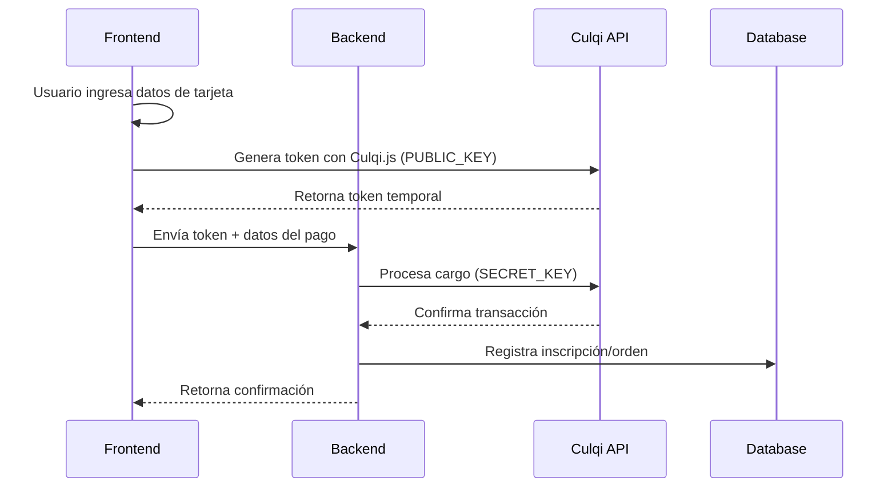

# Guía de Integración Culqi - Procesamiento de Pagos

## 📋 Descripción General

Culqi es una pasarela de pagos latinoamericana que permite procesar pagos con tarjetas de crédito y débito. Esta guía documenta la implementación del servicio de Culqi basada en el proyecto LAVC 2025.

---

## 🔑 Configuración Requerida

### Variables de Entorno

Para integrar Culqi en tu proyecto, necesitas configurar las siguientes variables de entorno:

```env
CULQI_SECRET_KEY=sk_test_xxxxxxxxxxxxxxxx
```

> [!IMPORTANT]
> El `CULQI_SECRET_KEY` es tu clave secreta que permite autenticar las peticiones al API de Culqi. **NUNCA** expongas esta clave en el frontend.

### Valores Clave

| Variable | Descripción | Tipo | Ejemplo |
|----------|-------------|------|---------|
| `CULQI_SECRET_KEY` | Clave secreta de Culqi (Backend) | String | `sk_test_xxxxx` o `sk_live_xxxxx` |
| `CULQI_PUBLIC_KEY` | Clave pública de Culqi (Frontend) | String | `pk_test_xxxxx` o `pk_live_xxxxx` |
| `CULQI_URL` | URL del API de Culqi | String | `https://api.culqi.com/v2/charges` |

> [!TIP]
> Culqi tiene dos ambientes:
> - **Test**: Usa claves que empiezan con `pk_test_` y `sk_test_`
> - **Producción**: Usa claves que empiezan con `pk_live_` y `sk_live_`

---

## 🏗️ Arquitectura del Servicio

### Flujo de Pago



### Componentes Principales

1. **Frontend**: Captura datos de tarjeta usando Culqi.js
2. **Backend**: Procesa el cargo usando el token generado
3. **Culqi API**: Valida y procesa la transacción
4. **Database**: Almacena el registro del pago

---

## 💻 Implementación Backend

### Estructura del Servicio

```typescript
@Injectable()
export class CulqiService {
  private readonly culqiUrl = 'https://api.culqi.com/v2/charges';
  private readonly secretKey = process.env.CULQI_SECRET_KEY;

  constructor(
    // Inyecta los servicios que necesites para registrar el pago
    private readonly orderService: OrderService,
  ) {}

  async processPayment(paymentData: CulqiPaymentDto) {
    // Implementación del pago
  }
}
```

### DTO de Pago (CulqiPaymentDto)

```typescript
export class CulqiPaymentDto {
  // ⭐ DATOS REQUERIDOS POR CULQI API
  @IsString()
  @IsNotEmpty()
  token: string;              // Token generado en el frontend

  @IsNumber()
  @IsNotEmpty()
  amount: number;             // Monto en centavos (ej: 5000 = S/50.00)

  @IsString()
  @IsNotEmpty()
  currency: string;           // Código de moneda: 'PEN' o 'USD'

  @IsString()
  @IsNotEmpty()
  email: string;              // Email del cliente

  // ⭐ DATOS DE TU APLICACIÓN (personalizables)
  @IsNumber()
  @IsNotEmpty()
  userCode: number;           // ID del usuario en tu sistema

  @IsNumber()
  @IsNotEmpty()
  eventCode: number;          // ID del evento/producto en tu sistema

  @IsString()
  @IsNotEmpty()
  typeOfPayment: string;      // Tipo de comprobante: 'boleta' o 'factura'

  @IsString()
  @IsNotEmpty()
  paymentMethod: string;      // Método de pago (ej: 'CULQI', 'CULQI_DOLARES')

  // ⭐ DATOS OPCIONALES PARA FACTURACIÓN
  @IsString()
  @IsOptional()
  companyName?: string;       // Razón social (solo para facturas)

  @IsString()
  @IsOptional()
  ruc?: string;               // RUC o número de documento fiscal
}
```

> [!WARNING]
> El campo `amount` debe enviarse en **centavos**:
> - S/50.00 = `5000`
> - $10.50 = `1050`

### Método de Procesamiento de Pago

```typescript
async processPayment(paymentData: CulqiPaymentDto) {
  try {
    // 1️⃣ Enviar cargo a Culqi API
    const response = await axios.post(
      this.culqiUrl,
      {
        amount: paymentData.amount,           // Monto en centavos
        currency_code: paymentData.currency,  // 'PEN' o 'USD'
        email: paymentData.email,             // Email del cliente
        source_id: paymentData.token,         // Token del frontend
      },
      {
        headers: {
          Authorization: `Bearer ${this.secretKey}`,
          'Content-Type': 'application/json',
        },
      },
    );

    const paymentResponse = response.data;

    // 2️⃣ Verificar que el pago fue exitoso
    if (
      paymentResponse.outcome?.code === 'AUT0000' &&
      paymentResponse.outcome?.type === 'venta_exitosa'
    ) {
      console.log("✅ Pago aprobado, registrando en base de datos...");

      // 3️⃣ Registrar el pago en tu base de datos
      const saveData = {
        userId: paymentData.userCode,
        productId: paymentData.eventCode,
        paymentMethod: paymentData.paymentMethod,
        email: paymentData.email,
        amount: paymentData.amount,
        receiptType: paymentData.typeOfPayment,
        invoiceNumber: paymentData.ruc,
        companyName: paymentData.companyName,
        status: 'paid'
      };

      await this.orderService.create(saveData);
    }

    return response.data;
  } catch (error) {
    console.error('Error procesando pago Culqi:', error);
    throw new HttpException(
      error.response?.data || 'Error en el pago',
      HttpStatus.BAD_REQUEST,
    );
  }
}
```

---

## 🎨 Implementación Frontend

### 1. Instalar Culqi.js

Agrega el script de Culqi en tu HTML o Next.js:

```html
<script src="https://checkout.culqi.com/js/v4"></script>
```

En Next.js:

```typescript
// En tu componente o layout
useEffect(() => {
  const script = document.createElement('script');
  script.src = 'https://checkout.culqi.com/js/v4';
  script.async = true;
  document.body.appendChild(script);
}, []);
```

### 2. Configurar Culqi Frontend

```typescript
// Configuración de Culqi
const Culqi = window.Culqi;

Culqi.publicKey = 'pk_test_xxxxxxxxxxxxxxxx'; // Tu clave pública

// Callback cuando se genera el token
Culqi.options({
  lang: 'es',
  modal: true,
  installments: false,
  customButton: '#culqi-button'
});

Culqi.settings({
  title: 'Mi Tienda',
  currency: 'PEN',
  amount: 5000 // Monto en centavos
});
```

### 3. Generar Token y Procesar Pago

```typescript
async function handlePayment() {
  // 1️⃣ Abrir modal de Culqi
  Culqi.open();
  
  // 2️⃣ Esperar a que se genere el token
  Culqi.options({
    handler: async function () {
      const token = Culqi.token.id;
      
      // 3️⃣ Enviar token a tu backend
      const paymentData = {
        token: token,
        amount: 5000,              // S/50.00
        currency: 'PEN',
        email: 'cliente@example.com',
        userCode: 123,
        eventCode: 456,
        typeOfPayment: 'boleta',
        paymentMethod: 'CULQI'
      };
      
      try {
        const response = await fetch('/api/culqi/process-payment', {
          method: 'POST',
          headers: { 'Content-Type': 'application/json' },
          body: JSON.stringify(paymentData)
        });
        
        const result = await response.json();
        
        if (result.outcome?.code === 'AUT0000') {
          alert('✅ Pago exitoso!');
        }
      } catch (error) {
        alert('❌ Error procesando el pago');
      }
    }
  });
}
```

---

## 📊 Respuestas de la API Culqi

### Respuesta Exitosa

```json
{
  "object": "charge",
  "id": "chr_test_xxxxxxxxxx",
  "amount": 5000,
  "currency_code": "PEN",
  "email": "cliente@example.com",
  "outcome": {
    "code": "AUT0000",
    "type": "venta_exitosa",
    "merchant_message": "La operación de venta ha sido autorizada exitosamente"
  },
  "reference_code": "ABC1234567",
  "source": {
    "id": "tkn_test_xxxxxxxxxx"
  },
  "creation_date": 1641234567000
}
```

### Códigos de Respuesta Importantes

| Código | Tipo | Descripción |
|--------|------|-------------|
| `AUT0000` | `venta_exitosa` | ✅ Pago aprobado |
| `REV0000` | `venta_rechazada` | ❌ Pago rechazado |
| `ERR001` | `error` | ⚠️ Error en los parámetros |

---

## 🔒 Seguridad

> [!CAUTION]
> **Nunca expongas tu SECRET_KEY en el frontend**

### Buenas Prácticas

1. ✅ **Backend**: Usa `CULQI_SECRET_KEY` solo en el servidor
2. ✅ **Frontend**: Usa `CULQI_PUBLIC_KEY` para generar tokens
3. ✅ **Validación**: Verifica siempre el código de respuesta `AUT0000`
4. ✅ **SSL/TLS**: Usa HTTPS en producción
5. ✅ **Logs**: No registres números de tarjeta en logs

### Variables de Entorno

```env
# .env
CULQI_SECRET_KEY=sk_live_xxxxxxxxxxxxxxxx
CULQI_PUBLIC_KEY=pk_live_xxxxxxxxxxxxxxxx
```

```typescript
// ❌ INCORRECTO - No hagas esto
const secretKey = 'sk_live_xxxxxxxx';

// ✅ CORRECTO
const secretKey = process.env.CULQI_SECRET_KEY;
```

---

## 💰 Monedas Soportadas

| Código | Moneda | Ejemplo |
|--------|--------|---------|
| `PEN` | Soles Peruanos | S/50.00 = `5000` centavos |
| `USD` | Dólares Americanos | $10.50 = `1050` centavos |

---

## 🧪 Testing

### Tarjetas de Prueba (Ambiente Test)

| Tipo | Número | CVV | Fecha | Resultado |
|------|--------|-----|-------|-----------|
| Visa | `4111 1111 1111 1111` | `123` | `09/2025` | ✅ Aprobado |
| Mastercard | `5111 1111 1111 1118` | `472` | `06/2025` | ✅ Aprobado |
| Visa | `4222 2222 2222 2220` | `123` | `09/2025` | ❌ Rechazado |

---

## 📚 Recursos Adicionales

- [Documentación Oficial Culqi](https://docs.culqi.com/)
- [API Reference](https://apidocs.culqi.com/)
- [Dashboard Culqi](https://integ-panel.culqi.com/)

---

## ✅ Checklist de Implementación

- [ ] Obtener credenciales de Culqi (PUBLIC_KEY y SECRET_KEY)
- [ ] Configurar variables de entorno
- [ ] Crear DTO de pago adaptado a tu aplicación
- [ ] Implementar servicio backend de procesamiento
- [ ] Integrar Culqi.js en el frontend
- [ ] Probar con tarjetas de prueba
- [ ] Implementar manejo de errores
- [ ] Verificar flujo completo end-to-end
- [ ] Migrar a credenciales de producción
- [ ] Configurar webhook para notificaciones (opcional)

---

## 🔄 Adaptación a Otros Proyectos

Para usar esta integración en otro proyecto, solo necesitas:

1. **Copiar las credenciales**: `CULQI_SECRET_KEY` y `CULQI_PUBLIC_KEY`
2. **Adaptar el DTO**: Modifica `CulqiPaymentDto` según tus entidades (productos, órdenes, etc.)
3. **Cambiar la lógica de guardado**: Reemplaza `inscripcionService` por tu servicio de órdenes/productos
4. **Mantener la estructura**: El flujo de comunicación con Culqi API es el mismo

> [!NOTE]
> La URL de Culqi (`https://api.culqi.com/v2/charges`) es la misma para todos los proyectos. Solo cambian las credenciales.
